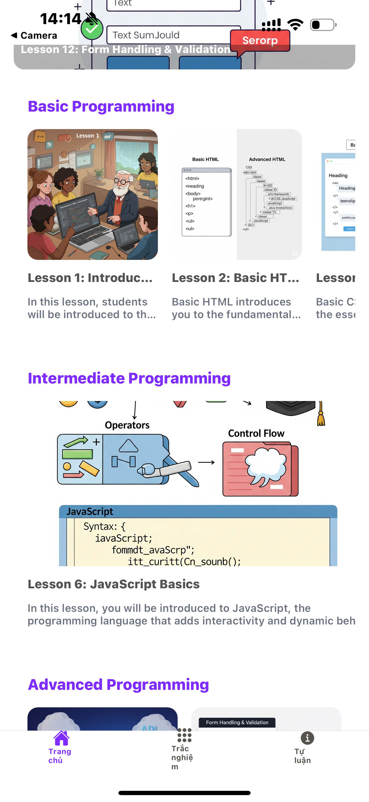

# **Code Studio – Learn Programming Every Day**

**Code Studio** is a powerful and interactive learning app designed to help you master coding from beginner to advanced levels. With daily lessons, hands-on projects, and smart tracking, you’ll build your skills in HTML, CSS, JavaScript, and more — one line at a time!

[DEMO](https://drive.google.com/file/d/1MKTk-J7RyQNJV7kIePxYQ24sHfbMEvJN/view?usp=sharing)

## Key Features

- **Video Lessons by Level**: Courses are organized by difficulty — from beginner syntax to full-stack development — guiding learners step-by-step through their coding journey.
- **Expert-Curated Content**: All content is reviewed and crafted by experienced developers to ensure it's accurate, up-to-date, and practical.

- **Interactive Coding Challenges**: After each lesson, users can complete real coding tasks and multiple-choice quizzes to test their knowledge and skills.

- **Project-Based Practice**: Learners apply what they’ve learned by building mini projects such as websites, games, and web apps — reinforcing both syntax and logic.

## Technology Learning

- **React Native**:  Cross-platform app development ensures consistent experiences on both Android and iOS.

- **Redux Toolkit**: Efficiently tracks lesson progress, user preferences, and coding scores.
- **Supabase**:
  - **Authentication**:  Easy login and account management for learners.
  - **Realtime Database**: Syncs your code progress, quiz results, and achievements in real time.
  - **File Storage**: Stores lesson files, project templates, and user submissions securely and efficiently.
